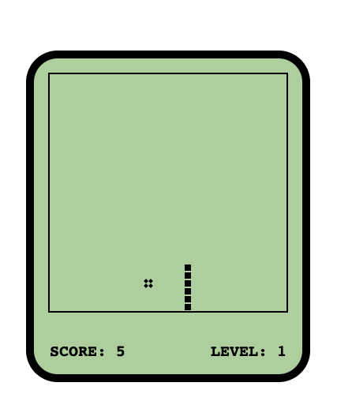

# SNAKE GAME

SNAKE is an webapp game that allow user to control the moving direction of a snake and eat food to grow its length. App has been deployed to Netlify and can be found [here](https://snake-zxw.netlify.app/).

## Language & Framework

- [x] TypeScript
- [x] Less
- [x] Webpack
- [x] Babel

## Screenshot

#### Game Panel

## Game Instruction

#### Operation Control

|  Hot Key   |    Move    |
| :--------: | :--------: |
|  ArrowUp   |  Move Up   |
| ArrowDown  | Move Down  |
| ArrowLeft  | Move Left  |
| ArrowRight | Move Right |

#### Score & Level (Highest Level: 10)

|   Situation    |        Result        |
| :------------: | :------------------: |
| Snake ate food | Score increment by 1 |
|  Scored by 10  |    Level up by 1     |

#### Outta Control

|        Situation         | Consequence |
| :----------------------: | :---------: |
|    Opposite Direction    | Not Allowed |
|    Bumped into Border    |  Game Over  |
| Bumped into Snake itself |  Game Over  |
